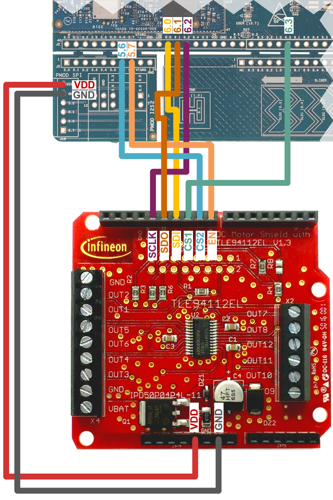

# Multi half-bridge

This code example demonstrates the basic usage of the Infineon [TLE94112 multi half-bridge shield](https://www.infineon.com/cms/en/product/evaluation-boards/tle94112el_shield/) together with supported ModusToolbox™ MCUs for motor control applications. 

The example consists of a set of code snippets based on the [multi half-bridge
library](https://github.com/Infineon/multi-half-bridge) API. 

## Requirements

- [ModusToolbox&trade; software](https://www.infineon.com/cms/en/design-support/tools/sdk/modustoolbox-software/) v2.4

    **Note:** This code example version requires ModusToolbox&trade; software version 2.4 or later and is not backward compatible with v2.3 or older versions.
- Programming language: C++
- Associated parts: Infineon controllers supporting the [ModusToolbox&trade; hardware abstraction layer (HAL)](https://github.com/Infineon/mtb-hal-cat1)
- [Multi half-bridge
  ICs](https://www.infineon.com/cms/de/product/power/motor-control-ics/brushed-dc-motor-driver-ics/multi-half-bridge-ics/)
- Motor or controlling load

## Supported toolchains (make variable 'TOOLCHAIN')

- GNU Arm® embedded compiler v10.3.1 (`GCC_ARM`) - Default value of `TOOLCHAIN`
- Arm® compiler v6.16 (`ARM`)
- IAR C/C++ compiler v8.50.6 (`IAR`)

## Supported kits (make variable 'TARGET')

- [PSoC&trade; 6 Wi-Fi Bluetooth&trade; prototyping kit](https://www.cypress.com/CY8CPROTO-062-4343W) (CY8CPROTO-062-4343W) - Default value of `TARGET`
- Infineon MCU kits support the [ModusToolbox&trade; hardware abstraction layer (HAL)](https://github.com/Infineon/mtb-hal-cat1) in their board support package (BSP).

## Hardware setup

If you have an MCU board header compatible with Arduino, then place the multi-half-bridge shield on top of this board.

For all other ModusToolbox&trade; MCU evaluation kits, you must wire the correct SPI pins from the board to the shield, including the EN (enable board) pin, VDD, and GND.
The following figure is an example of the [PSoC&trade; 6 Wi-Fi Bluetooth&reg; prototyping kit (CY8CPROTO-062-4343W)](https://www.infineon.com/cms/en/product/evaluation-boards/cy8cproto-062-4343w/).



Check each example description to find out their specific load connection details.
In most cases, by default, the load high-side is connected to OUTPUT 1 and the low-side of the load to OUTPUT 5.

## Software setup

Install a terminal emulator if you don't have one. Instructions in this document use [Tera Term](https://ttssh2.osdn.jp/index.html.en).

This example requires no additional software or tools.

## Using the code example

Create the project and open it using one of the following:

<details><summary><b>In Eclipse IDE for ModusToolbox&trade; software</b></summary>

1. Click the **New Application** link in the **Quick Panel** (or, use **File** > **New** > **ModusToolbox Application**). This launches the [Project Creator](https://www.infineon.com/dgdl/Infineon-ModusToolbox_Project_Creator_Guide_3-UserManual-v01_00-EN.pdf?fileId=8ac78c8c7d718a49017d99bcabbd31e5&utm_source=cypress&utm_medium=referral&utm_campaign=202110_globe_en_all_integration-files) tool.

2. Pick the CY8CPROTO-062-4343W BSP from the list shown in the **Project Creator - Choose Board Support Package (BSP)** dialog.

   When you select a supported kit, the example is reconfigured automatically to work with the kit. To work with a different supported kit later, use the [Library Manager](https://www.infineon.com/dgdl/Infineon-ModusToolbox_Library_Manager_User_Guide_3-UserManual-v01_00-EN.pdf?fileId=8ac78c8c7d718a49017d99ab34b831ce&utm_source=cypress&utm_medium=referral&utm_campaign=202110_globe_en_all_integration-files) to choose the BSP for the supported kit. You can use the Library Manager to select or update the BSP and firmware libraries used in this application. To access the Library Manager, click the link from the **Quick Panel**.

   You can also just start the application creation process again and select a different kit. The BSP selected requires as capabilities the [ModusToolbox&trade; hardware abstraction layer (HAL)](https://github.com/Infineon/mtb-hal-cat1) and an SPI peripheral interface.

   If you want to use the application for a kit not listed here, you may need to update the source files. If the kit does not have the required resources, the application may not work.

3. In the **Project Creator - Select Application** dialog, choose the example "Multi Half-Bridge" by enabling the checkbox.

4. (Optional) Change the suggested **New Application Name**.

5. The **Application(s) Root Path** defaults to the Eclipse workspace which is usually the desired location for the application. If you want to store the application in a different location, you can change the *Application(s) Root Path* value. Applications that share libraries should be in the same root path.

6. Click **Create** to complete the application creation process.

For more details, see the [Eclipse IDE for ModusToolbox&trade; software user guide](https://www.infineon.com/dgdl/Infineon-Eclipse_IDE_for_ModusToolbox_User_Guide_1-UserManual-v01_00-EN.pdf?fileId=8ac78c8c7d718a49017d99bcb86331e8&utm_source=cypress&utm_medium=referral&utm_campaign=202110_globe_en_all_integration-files) (locally available at *{ModusToolbox&trade; software install directory}/ide_{version}/docs/mt_ide_user_guide.pdf*).

</details>

<details><summary><b>In command-line interface (CLI)</b></summary>

ModusToolbox&trade; software provides the Project Creator as both a GUI tool and the command line tool, "project-creator-cli". The CLI tool can be used to create applications from a CLI terminal or from within batch files or shell scripts. This tool is available in the *{ModusToolbox&trade; software install directory}/tools_{version}/project-creator/* directory.

Use a CLI terminal to invoke the "project-creator-cli" tool. On Windows, use the command line "modus-shell" program provided in the ModusToolbox&trade; software installation instead of a standard Windows command-line application. This shell provides access to all ModusToolbox&trade; software tools. You can access it by typing `modus-shell` in the search box in the Windows menu. In Linux and macOS, you can use any terminal application.

This tool has the following arguments:

Argument | Description | Required/optional
---------|-------------|-----------
`--board-id` | Defined in the `<id>` field of the [BSP](https://github.com/Infineon?q=bsp-manifest&type=&language=&sort=) manifest | Required
`--app-id`   | Defined in the `<id>` field of the [CE](https://github.com/Infineon/mtb-ce-manifest) manifest | Required
`--target-dir`| Specify the directory in which the application is to be created if you prefer not to use the default current working directory | Optional
`--user-app-name`| Specify the name of the application if you prefer to have a name other than the example's default name | Optional


The following example will clone the [Multi half-bridge](https://github.com/Infineon/mtb-example-multi-half-bridge) application with the desired name "MultiHalfBridge" configured for the *CY8CPROTO-062-4343W* BSP into the specified working directory, *C:/mtb_projects*:

   ```
   project-creator-cli --board-id CY8CPROTO-062-4343W --app-id mtb-example-multi-half-bridge --user-app-name MultiHalfBridge --target-dir "C:/mtb_projects"
   ```

**Note:** The project-creator-cli tool uses the `git clone` and `make getlibs` commands to fetch the repository and import the required libraries. For details, see the "Project creator tools" section of the [ModusToolbox&trade; software user guide](https://www.cypress.com/ModusToolboxUserGuide) (locally available at *{ModusToolbox&trade; software install directory}/docs_{version}/mtb_user_guide.pdf*).

</details>

<details><summary><b>In third-party IDEs</b></summary>

Use one of the following options:

- **Use the standalone [Project Creator](https://www.infineon.com/dgdl/Infineon-ModusToolbox_Project_Creator_Guide_3-UserManual-v01_00-EN.pdf?fileId=8ac78c8c7d718a49017d99bcabbd31e5&utm_source=cypress&utm_medium=referral&utm_campaign=202110_globe_en_all_integration-files) tool:**

   1. Launch Project Creator from the Windows Start menu or from *{ModusToolbox&trade; software install directory}/tools_{version}/project-creator/project-creator.exe*.

   2. In the initial **Choose Board Support Package** screen, select the BSP, and click **Next**.

   3. In the **Select Application** screen, select the appropriate IDE from the **Target IDE** drop-down menu.

   4. Click **Create** and follow the instructions printed in the bottom pane to import or open the exported project in the respective IDE.

<br>

- **Use command-line interface (CLI):**

   1. Follow the instructions from the **In command-line interface (CLI)** section to create the application, and then import the libraries using the `make getlibs` command.

   2. Export the application to a supported IDE using the `make <ide>` command.

   3. Follow the instructions displayed in the terminal to create or import the application as an IDE project.

For a list of supported IDEs and more details, see the "Exporting to IDEs" section of the [ModusToolbox&trade; software user guide](https://www.infineon.com/dgdl/Infineon-ModusToolbox_2.4_User_Guide-Software-v01_00-EN.pdf?fileId=8ac78c8c7e7124d1017ed97e72563632&utm_source=cypress&utm_medium=referral&utm_campaign=202110_globe_en_all_integration-files) (locally available at *{ModusToolbox&trade; software install directory}/docs_{version}/mtb_user_guide.pdf*).

</details>

## Operation

1. Connect the CY8CPROTO-062-4343W kit with the DC motor shield and the adequate motor to the PC through the USB of the PSoC&trade; 6 kit.
2. Open a terminal program and select the KitProg3 COM port. Set the serial port parameters to 8N1 and 115200 baud.
3. Select the desired example to be executed. These examples are included:

    ```

   //!< This is a list of all examples which are covered here.
   enum examples_t
   {
      BASICTEST            = 1,      //!< \brief basicTest just starts and stops a motor */
      ADVANCEDTEST,                  //!< \brief advanceTest runs a motor up and down */
      ERRORDIAGNOSIS,                //!< \brief errorDiagnosis shows the use of the error registers */
      HALFBRIDGE,                    //!< \brief halfBridge shows the use of only the controller library
      LEDMODE,                       //!< \brief ledMode shows how to lower the sensitivity for open load detection
      STEPPERMOTOR,                  //!< \brief stepperMotor shows how to drive voltage-controlled bipolar stepper motors
      MULTIPLECONTROLLERS,           //!< \brief multipleControllers shows how to implement stacked shields */
      MULTIPLEMOTORS                 //!< \brief multipleMotors shows how to use more than one motor */
   };

    ```

    You can change the running example by just changing the *EXAMPLE* definition:
    ```

    //!> Select the example which is compiled. There are several different examples defined that can be switched here.
    #define EXAMPLE                     BASICTEST

    ```
    Several example functions for the basic API functions flows of the library are provided. Find more information about each example in the header files of each of the examples folders.

    There is also a possibility to change between single or multiple half-bridges, in case your motor needs more current than the 0.9 A, which a half-bridge can deliver.
    ```
    // Select the number of connected half-bridges to be used
    // If only two half-bridges are used (one high, one low) then a motor with only 0.9 A can be used, otherwise the controller will signal an over-current error.
    // If your motor or application needs more than multiple half-bridges can be connected.
    // If you choose four half-bridges then 1.8 A can be reached.
    // The following settings are possible:
    // - 2U two half-bridges with 0.9A are used, which is sufficient for small motors. This is the default setting
    // - 4U with 1.8A, which is sufficient for bigger motors like most computer fans
    #define TWO_BRIDGES                 2U
    #define FOUR_BRIDGES                4U
    #define MULTI_HALF_BRIDGES          TWO_BRIDGES

    ```
    Just change from *TWO_BRIDGES* to *FOUR_BRIDGES*.
    - *TWO_BRIDGES* means use H1 and H5
    - *FOUR_BRIDGES* means uses H1/H2 and H3/H4

4. After building and programming, the serial terminal application will print out the example results and relevant information about the executed functions.

## Debugging


You can debug the example to step through the code. In the IDE, use the **\<Application Name> Debug (KitProg3_MiniProg4)** configuration in the **Quick Panel**. For details, see the "Program and debug" section in the [Eclipse IDE for ModusToolbox&trade; software user guide](https://www.infineon.com/dgdl/Infineon-Eclipse_IDE_for_ModusToolbox_User_Guide_1-UserManual-v01_00-EN.pdf?fileId=8ac78c8c7d718a49017d99bcb86331e8&utm_source=cypress&utm_medium=referral&utm_campaign=202110_globe_en_all_integration-files).

**Note:** **(Only while debugging)** On the CM4 CPU, some code in `main()` may execute before the debugger halts at the beginning of `main()`. This means that some code executes twice – once before the debugger stops execution, and again after the debugger resets the program counter to the beginning of `main()`. See [KBA231071](https://community.infineon.com/t5/Knowledge-Base-Articles/PSoC-6-MCU-Code-in-main-executes-before-the-debugger-halts-at-the-first-line-of/ta-p/253856) to learn about this and for the workaround.

Additionally, the multi half-bridge library provides debug log traces. These can be enabled in the ```src/config/tl94112-conf.hpp``` file of the multi-half-bridge folder (by default located under ```mtb_shared``` folder of the ModusToolbox workspace).

## Design and implementation

The following project provides multiple directories with independent application examples, which provide several functions showing examples of how to use the multi half-bridge API and use cases of the library:

- basicTest
- advancedTest
- errorDiagnosis
- halfBridge
- ledMode
- multipleControllers
- multipleMotors
- stepperMotor

Find more information about the multi-half-bridge library in the [wiki](https://github.com/Infineon/multi-half-bridge/wiki).

<br>

## Related resources


Resources  | Links
-----------|----------------------------------
Application notes | [AN228571](https://www.infineon.com/dgdl/Infineon-AN228571_Getting_started_with_PSoC_6_MCU_on_ModusToolbox_software-ApplicationNotes-v06_00-EN.pdf?fileId=8ac78c8c7cdc391c017d0d36de1f66d1&utm_source=cypress&utm_medium=referral&utm_campaign=202110_globe_en_all_integration-application_note) – Getting started with PSoC&trade; 6 MCU on ModusToolbox&trade; software
Code examples | [Using ModusToolbox&trade; software](https://github.com/Infineon/Code-Examples-for-ModusToolbox-Software)
Device documentation | [PSoC&trade; 6 MCU datasheets](https://www.infineon.com/cms/en/search.html#!view=downloads&term=PSoC%206&doc_group=Data%20Sheet) <br> [PSoC&trade; 6 technical reference manuals](https://www.infineon.com/cms/en/search.html#!view=downloads&term=PSoC%206&doc_group=Additional%20Technical%20Information)
Development kits| Select your kits from the [Evaluation board finder](https://www.infineon.com/cms/en/design-support/finder-selection-tools/product-finder/evaluation-board) page
Libraries on GitHub | [mtb-pdl-cat1](https://github.com/Infineon/mtb-pdl-cat1) – PSoC&trade; 6 peripheral driver library (PDL) <br>   [mtb-hal-cat1](https://github.com/Infineon/mtb-hal-cat1) – Hardware abstraction layer (HAL) <br> [retarget-io](https://github.com/Infineon/retarget-io) – Utility library to retarget STDIO messages to a UART port
Middleware on GitHub | [psoc6-middleware](https://github.com/Infineon/modustoolbox-software) – Links to all PSoC&trade; 6 MCU middleware <br> [multi-half-bridge](https://github.com/Infineon/multi-half-bridge) – Multi half-bridge C++ library
Tools | [Eclipse IDE for ModusToolbox&trade; software](https://www.infineon.com/cms/en/design-support/tools/sdk/modustoolbox-software/) – ModusToolbox&trade; software is a collection of easy-to-use software and tools enabling rapid development with Infineon MCUs, covering applications from embedded sense and control to wireless and cloud-connected systems using AIROC&trade; Wi-Fi and Bluetooth® connectivity devices. 

<br>

## Other resources

Infineon provides a wealth of data at www.infineon.com to help you select the right device, and quickly and effectively integrate it into your design.

## Document history

Document title: *CE236069* - *Multi-half bridge*


 Version | Description of change
 ------- | ---------------------
 1.0.0   | New code example

<br>

---------------------------------------------------------

© Cypress Semiconductor Corporation, 2022. This document is the property of Cypress Semiconductor Corporation, an Infineon Technologies company, and its affiliates ("Cypress").  This document, including any software or firmware included or referenced in this document ("Software"), is owned by Cypress under the intellectual property laws and treaties of the United States and other countries worldwide.  Cypress reserves all rights under such laws and treaties and does not, except as specifically stated in this paragraph, grant any license under its patents, copyrights, trademarks, or other intellectual property rights.  If the Software is not accompanied by a license agreement and you do not otherwise have a written agreement with Cypress governing the use of the Software, then Cypress hereby grants you a personal, non-exclusive, nontransferable license (without the right to sublicense) (1) under its copyright rights in the Software (a) for Software provided in source code form, to modify and reproduce the Software solely for use with Cypress hardware products, only internally within your organization, and (b) to distribute the Software in binary code form externally to end users (either directly or indirectly through resellers and distributors), solely for use on Cypress hardware product units, and (2) under those claims of Cypress’s patents that are infringed by the Software (as provided by Cypress, unmodified) to make, use, distribute, and import the Software solely for use with Cypress hardware products.  Any other use, reproduction, modification, translation, or compilation of the Software is prohibited.
<br>
TO THE EXTENT PERMITTED BY APPLICABLE LAW, CYPRESS MAKES NO WARRANTY OF ANY KIND, EXPRESS OR IMPLIED, WITH REGARD TO THIS DOCUMENT OR ANY SOFTWARE OR ACCOMPANYING HARDWARE, INCLUDING, BUT NOT LIMITED TO, THE IMPLIED WARRANTIES OF MERCHANTABILITY AND FITNESS FOR A PARTICULAR PURPOSE.  No computing device can be absolutely secure.  Therefore, despite security measures implemented in Cypress hardware or software products, Cypress shall have no liability arising out of any security breach, such as unauthorized access to or use of a Cypress product. CYPRESS DOES NOT REPRESENT, WARRANT, OR GUARANTEE THAT CYPRESS PRODUCTS, OR SYSTEMS CREATED USING CYPRESS PRODUCTS, WILL BE FREE FROM CORRUPTION, ATTACK, VIRUSES, INTERFERENCE, HACKING, DATA LOSS OR THEFT, OR OTHER SECURITY INTRUSION (collectively, "Security Breach").  Cypress disclaims any liability relating to any Security Breach, and you shall and hereby do release Cypress from any claim, damage, or other liability arising from any Security Breach.  In addition, the products described in these materials may contain design defects or errors known as errata which may cause the product to deviate from published specifications. To the extent permitted by applicable law, Cypress reserves the right to make changes to this document without further notice. Cypress does not assume any liability arising out of the application or use of any product or circuit described in this document. Any information provided in this document, including any sample design information or programming code, is provided only for reference purposes.  It is the responsibility of the user of this document to properly design, program, and test the functionality and safety of any application made of this information and any resulting product.  "High-Risk Device" means any device or system whose failure could cause personal injury, death, or property damage.  Examples of High-Risk Devices are weapons, nuclear installations, surgical implants, and other medical devices.  "Critical Component" means any component of a High-Risk Device whose failure to perform can be reasonably expected to cause, directly or indirectly, the failure of the High-Risk Device, or to affect its safety or effectiveness.  Cypress is not liable, in whole or in part, and you shall and hereby do release Cypress from any claim, damage, or other liability arising from any use of a Cypress product as a Critical Component in a High-Risk Device. You shall indemnify and hold Cypress, including its affiliates, and its directors, officers, employees, agents, distributors, and assigns harmless from and against all claims, costs, damages, and expenses, arising out of any claim, including claims for product liability, personal injury or death, or property damage arising from any use of a Cypress product as a Critical Component in a High-Risk Device. Cypress products are not intended or authorized for use as a Critical Component in any High-Risk Device except to the limited extent that (i) Cypress’s published data sheet for the product explicitly states Cypress has qualified the product for use in a specific High-Risk Device, or (ii) Cypress has given you advance written authorization to use the product as a Critical Component in the specific High-Risk Device and you have signed a separate indemnification agreement.
<br>
Cypress, the Cypress logo, and combinations thereof, WICED, ModusToolbox, PSoC, CapSense, EZ-USB, F-RAM, and Traveo are trademarks or registered trademarks of Cypress or a subsidiary of Cypress in the United States or in other countries. For a more complete list of Cypress trademarks, visit cypress.com. Other names and brands may be claimed as property of their respective owners.
